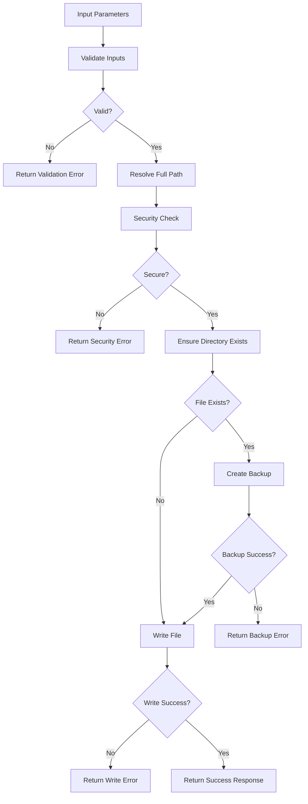

# Design Document

## Overview

The createDoc utility is a core file system utility that provides secure, reliable document creation capabilities for the WhatsFresh monorepo's document automation system. It follows the established patterns in the shared-imports package, providing a clean API with comprehensive error handling and security validation.

The utility will be implemented as an ES module following the same patterns as the existing logger utility, with proper JSDoc documentation and consistent error handling patterns.

## Architecture

### Module Structure

```
packages/shared-imports/src/utils/
├── fileOperations.js          # New createDoc utility
├── __tests__/
│   └── fileOperations.test.js # Unit tests
└── index.js                   # Updated exports
```

### Integration Points

- **Shared-imports exports**: Added to utils/index.js for monorepo-wide access
- **Document workflows**: Used by plan creation, analysis generation, and agent workflows
- **Error handling**: Integrates with existing logger utility for consistent error reporting
- **Security**: Implements path validation to prevent directory traversal attacks

## Components and Interfaces

### Core Function Interface

```javascript
/**
 * Create document with directory auto-creation and security validation
 * @param {string} filePath - Directory path (relative or absolute)
 * @param {string} fileName - File name with extension
 * @param {string} content - File content to write
 * @returns {Object} Response object with success status and details
 */
function createDoc(filePath, fileName, content)
```

### Response Interface

```javascript
// Success Response
{
  success: true,
  fullPath: string,        // Absolute path to created file
  message: string,         // Success message
  backupCreated?: string   // Path to backup file if one was created
}

// Error Response
{
  success: false,
  error: string,           // Technical error message
  message: string,         // User-friendly message
  code?: string           // Error categorization code
}
```

### Security Validation Component

```javascript
// Path Security Validator
const validatePath = (filePath, fileName) => {
  // Resolve absolute path
  // Check for path traversal attempts
  // Validate filename characters
  // Ensure path stays within project boundaries
};
```

### File Operations Component

```javascript
// File System Operations
const fileOperations = {
  ensureDirectory: (dirPath) => {
    /* Create directory recursively */
  },
  createBackup: (filePath) => {
    /* Create timestamped backup */
  },
  writeFile: (filePath, content) => {
    /* Write with UTF-8 encoding */
  },
  validateContent: (content) => {
    /* Validate content is string */
  },
};
```

## Data Models

### Input Validation Model

```javascript
const InputSchema = {
  filePath: {
    type: "string",
    required: true,
    validation: "non-empty string, valid path characters",
  },
  fileName: {
    type: "string",
    required: true,
    validation: "alphanumeric, dash, underscore, dot only",
  },
  content: {
    type: "string",
    required: true,
    validation: "valid UTF-8 string",
  },
};
```

### Security Model

```javascript
const SecurityConstraints = {
  allowedFileNamePattern: /^[a-zA-Z0-9\-_\.]+$/,
  projectBoundary: process.cwd(),
  maxFileSize: 10 * 1024 * 1024, // 10MB limit
  allowedExtensions: [".md", ".txt", ".json", ".js", ".ts", ".jsx", ".tsx"],
};
```

### Error Classification Model

```javascript
const ErrorTypes = {
  VALIDATION_ERROR: "Input validation failed",
  SECURITY_ERROR: "Security constraint violation",
  PERMISSION_ERROR: "File system permission denied",
  DISK_ERROR: "Disk space or I/O error",
  BACKUP_ERROR: "Backup creation failed",
};
```

## Error Handling

### Error Hierarchy

1. **Input Validation Errors**

   - Invalid file path format
   - Invalid filename characters
   - Non-string content
   - Empty required parameters

2. **Security Errors**

   - Path traversal attempts (../, ..\)
   - Paths outside project directory
   - Suspicious filename patterns

3. **File System Errors**

   - Permission denied
   - Disk space full
   - Directory creation failure
   - File write failure

4. **Backup Errors**
   - Cannot create backup of existing file
   - Backup location inaccessible

### Error Response Strategy

```javascript
const handleError = (error, context) => {
  // Log error with context
  logger.error(`createDoc failed: ${error.message}`, { context });

  // Return structured error response
  return {
    success: false,
    error: error.message,
    message: getUserFriendlyMessage(error),
    code: categorizeError(error),
  };
};
```

### Recovery Mechanisms

- **Backup restoration**: If file write fails after backup, restore original
- **Partial cleanup**: Remove partially created directories on failure
- **Retry logic**: For transient file system errors (optional future enhancement)

## Testing Strategy

### Unit Test Coverage

1. **Happy Path Tests**

   - Create new file in existing directory
   - Create file with new directory structure
   - Overwrite existing file with backup

2. **Validation Tests**

   - Invalid file paths
   - Invalid filenames
   - Non-string content
   - Empty parameters

3. **Security Tests**

   - Path traversal attempts
   - Files outside project directory
   - Malicious filename patterns

4. **Error Handling Tests**

   - Permission denied scenarios
   - Disk space full simulation
   - Directory creation failures

5. **Integration Tests**
   - Export from shared-imports
   - Usage in document workflows
   - Concurrent file operations

### Test Structure

```javascript
// packages/shared-imports/src/utils/__tests__/fileOperations.test.js
describe("createDoc", () => {
  describe("Happy Path", () => {
    test("creates new file successfully");
    test("creates directory structure");
    test("handles file overwrite with backup");
  });

  describe("Validation", () => {
    test("rejects invalid file paths");
    test("rejects invalid filenames");
    test("rejects non-string content");
  });

  describe("Security", () => {
    test("prevents path traversal");
    test("enforces project boundaries");
  });

  describe("Error Handling", () => {
    test("handles permission errors");
    test("handles disk space errors");
  });
});
```

### Mock Strategy

- **File system mocks**: Mock fs operations for predictable testing
- **Path mocks**: Mock path resolution for security testing
- **Error simulation**: Inject errors to test error handling paths

## Implementation Details

### Dependencies

```javascript
import fs from "fs";
import path from "path";
import { createLogger } from "./logger.js";
```

### Core Algorithm



### Performance Considerations

- **Synchronous operations**: Start with sync fs operations for simplicity
- **File size limits**: Implement reasonable limits to prevent memory issues
- **Directory caching**: Cache directory existence checks for repeated operations
- **Future async version**: Design allows for async implementation later

### Security Implementation

```javascript
const validateSecurity = (fullPath, fileName) => {
  // Ensure path stays within project
  const projectRoot = path.resolve(process.cwd());
  if (!fullPath.startsWith(projectRoot)) {
    throw new Error("Path outside project directory");
  }

  // Validate filename pattern
  if (!/^[a-zA-Z0-9\-_\.]+$/.test(fileName)) {
    throw new Error("Invalid filename characters");
  }

  // Additional security checks...
};
```

This design provides a robust, secure, and well-integrated file creation utility that serves as the foundation for the document automation system while maintaining consistency with existing codebase patterns.
