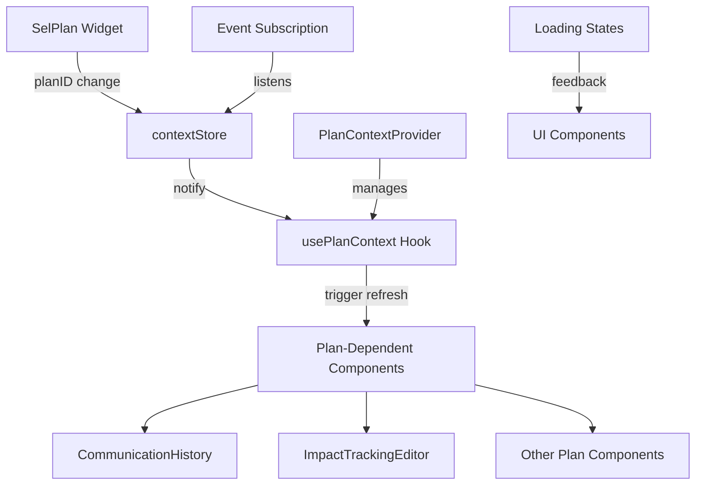
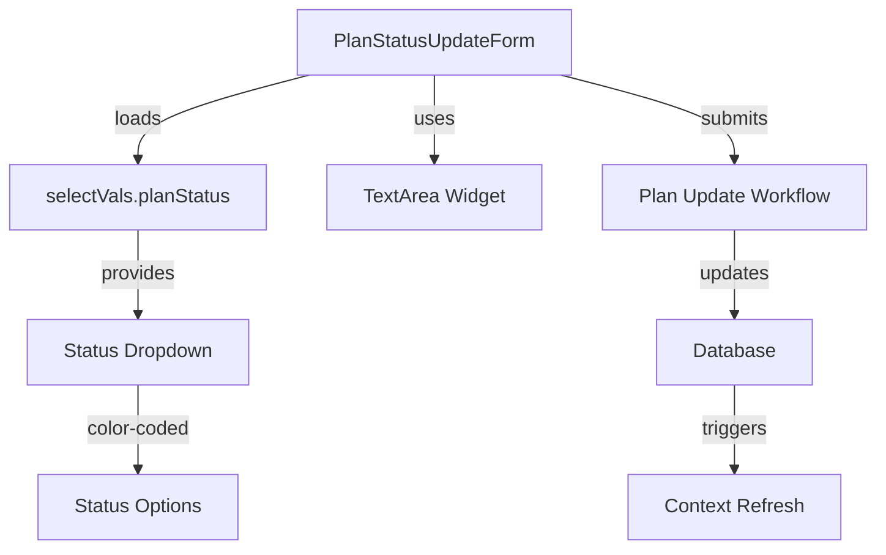

# Plan Context Refresh System Design

## Overview

Plan 34 implements two complementary enhancements to improve plan-dependent functionality:

1. **Context Refresh System**: Automatic data refresh when users switch between plans
2. **Enhanced Plan Status Update Form**: Comprehensive plan status management with reliable UI components

The design leverages React's context system, custom hooks, and established configuration patterns to create a seamless user experience for plan management.

## Architecture

### Context Refresh System Architecture



### Plan Status Update Form Architecture



## Components and Interfaces

### 1. Plan Context Management

#### PlanContextProvider

```javascript
// Context provider for plan-dependent components
const PlanContextProvider = ({ children }) => {
  const [currentPlanId, setCurrentPlanId] = useState(null);
  const [isLoading, setIsLoading] = useState(false);
  const [refreshTrigger, setRefreshTrigger] = useState(0);

  // Subscribe to contextStore changes
  useEffect(() => {
    const handlePlanChange = (newPlanId) => {
      if (newPlanId !== currentPlanId) {
        setCurrentPlanId(newPlanId);
        setRefreshTrigger((prev) => prev + 1);
      }
    };

    // Subscribe to contextStore planID changes
    contextStore.subscribe("planID", handlePlanChange);

    return () => contextStore.unsubscribe("planID", handlePlanChange);
  }, [currentPlanId]);

  return (
    <PlanContext.Provider
      value={{
        currentPlanId,
        isLoading,
        refreshTrigger,
        triggerRefresh: () => setRefreshTrigger((prev) => prev + 1),
      }}
    >
      {children}
    </PlanContext.Provider>
  );
};
```

#### usePlanContext Hook

```javascript
// Custom hook for plan-dependent components
const usePlanContext = (refreshCallback) => {
  const context = useContext(PlanContext);
  const [isRefreshing, setIsRefreshing] = useState(false);

  useEffect(() => {
    if (context.refreshTrigger > 0 && refreshCallback) {
      setIsRefreshing(true);
      refreshCallback(context.currentPlanId).finally(() =>
        setIsRefreshing(false)
      );
    }
  }, [context.refreshTrigger, refreshCallback]);

  return {
    ...context,
    isRefreshing,
  };
};
```

### 2. Enhanced ContextStore

#### Subscription System

```javascript
// Enhanced contextStore with subscription capabilities
class ContextStore {
  constructor() {
    this.parameters = {};
    this.subscribers = {};
  }

  setParameter(key, value) {
    const oldValue = this.parameters[key];
    this.parameters[key] = value;

    // Notify subscribers if value changed
    if (oldValue !== value && this.subscribers[key]) {
      this.subscribers[key].forEach((callback) => callback(value, oldValue));
    }
  }

  subscribe(key, callback) {
    if (!this.subscribers[key]) {
      this.subscribers[key] = [];
    }
    this.subscribers[key].push(callback);
  }

  unsubscribe(key, callback) {
    if (this.subscribers[key]) {
      this.subscribers[key] = this.subscribers[key].filter(
        (cb) => cb !== callback
      );
    }
  }
}
```

### 3. Plan Status Update Form

#### PlanStatusUpdateForm Component

```javascript
const PlanStatusUpdateForm = () => {
  const [formData, setFormData] = useState({
    status: "",
    comments: "",
  });
  const [statusOptions, setStatusOptions] = useState([]);
  const currentPlanId = contextStore.getParameter("planID");

  // Load status options from selectVals
  useEffect(() => {
    const loadStatusOptions = async () => {
      const { selectVals } = await import("../config/selectVals.json");
      setStatusOptions(selectVals.planStatus);
    };
    loadStatusOptions();
  }, []);

  const handleSubmit = async () => {
    // Submit to plan update workflow
    const result = await updatePlanStatus(currentPlanId, formData);
    if (result.success) {
      // Trigger context refresh
      contextStore.setParameter("planID", currentPlanId);
    }
  };

  return (
    <Box sx={{ width: "100%", maxWidth: 600 }}>
      <StatusDropdown
        value={formData.status}
        options={statusOptions}
        onChange={(value) =>
          setFormData((prev) => ({ ...prev, status: value }))
        }
      />
      <TextArea
        label="Status Update Comments"
        value={formData.comments}
        onChange={(value) =>
          setFormData((prev) => ({ ...prev, comments: value }))
        }
        minRows={4}
      />
      <Button onClick={handleSubmit}>Update Plan Status</Button>
    </Box>
  );
};
```

#### TextArea Widget

```javascript
// File: /packages/shared-imports/src/components/forms/TextArea.jsx
// Reliable TextArea widget to replace MultiLineField
const TextArea = ({
  label,
  value,
  onChange,
  minRows = 3,
  maxRows = 8,
  ...props
}) => {
  return (
    <TextField
      multiline
      minRows={minRows}
      maxRows={maxRows}
      value={value || ""}
      onChange={(e) => onChange(e.target.value)}
      label={label}
      variant="outlined"
      fullWidth
      sx={{
        "& .MuiInputBase-root": {
          minHeight: `${minRows * 24}px`,
          padding: "8px 12px",
        },
      }}
      {...props}
    />
  );
};

export default TextArea;

// Export in: /packages/shared-imports/src/jsx.js
// Add: export { default as TextArea } from "./components/forms/TextArea.jsx";
```

## Data Models

### Plan Context State

```javascript
interface PlanContextState {
  currentPlanId: string | null;
  isLoading: boolean;
  refreshTrigger: number;
  isRefreshing: boolean;
}
```

### Plan Status Configuration

```javascript
interface PlanStatusOption {
  value: string;
  label: string;
  color: "slate" | "blue" | "green" | "yellow" | "emerald" | "purple" | "gray";
  order: number;
}

interface SelectVals {
  planStatus: PlanStatusOption[];
}
```

### Plan Update Request

```javascript
interface PlanUpdateRequest {
  planId: string;
  status: string;
  comments: string;
  updatedBy: string;
  updatedAt: string;
}
```

## Error Handling

### Context Refresh Errors

- **Network failures**: Show retry button with exponential backoff
- **Invalid plan IDs**: Display "Plan not found" message with plan selector
- **Permission errors**: Show appropriate access denied message
- **Timeout errors**: Provide manual refresh option

### Plan Status Update Errors

- **Validation errors**: Highlight invalid fields with specific error messages
- **Concurrent updates**: Show conflict resolution options
- **Database errors**: Display generic error with retry option
- **Network errors**: Queue updates for retry when connection restored

### Error Recovery Patterns

```javascript
const useErrorRecovery = () => {
  const [error, setError] = useState(null);
  const [retryCount, setRetryCount] = useState(0);

  const handleError = (error, retryCallback) => {
    setError(error);

    // Automatic retry for network errors
    if (error.type === "network" && retryCount < 3) {
      setTimeout(() => {
        setRetryCount((prev) => prev + 1);
        retryCallback();
      }, Math.pow(2, retryCount) * 1000);
    }
  };

  return { error, handleError, clearError: () => setError(null) };
};
```

## Testing Strategy

### Unit Tests

- **usePlanContext hook**: Test subscription, unsubscription, and refresh triggers
- **ContextStore**: Test parameter setting, subscription notifications
- **PlanStatusUpdateForm**: Test form validation, submission, error handling
- **TextArea widget**: Test input handling, sizing, accessibility

### Integration Tests

- **Plan context flow**: Test SelPlan → contextStore → component refresh
- **Status update workflow**: Test form submission → database update → UI refresh
- **Error scenarios**: Test network failures, invalid data, concurrent updates

### End-to-End Tests

- **Plan switching**: Verify all components refresh when plan changes
- **Status updates**: Test complete status change workflow
- **Error recovery**: Test retry mechanisms and user feedback

### Performance Tests

- **Refresh efficiency**: Measure time from plan change to UI update
- **Memory usage**: Test for memory leaks in subscription system
- **Concurrent updates**: Test multiple simultaneous plan changes
