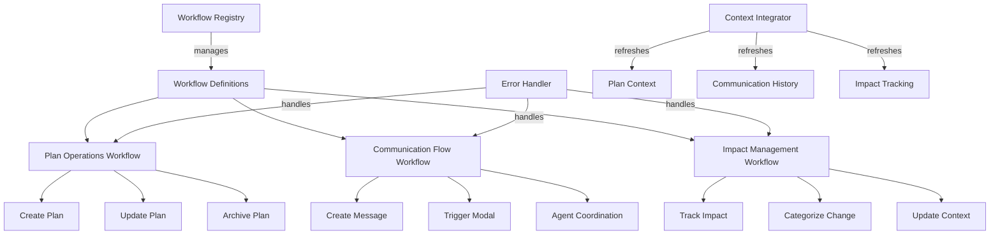
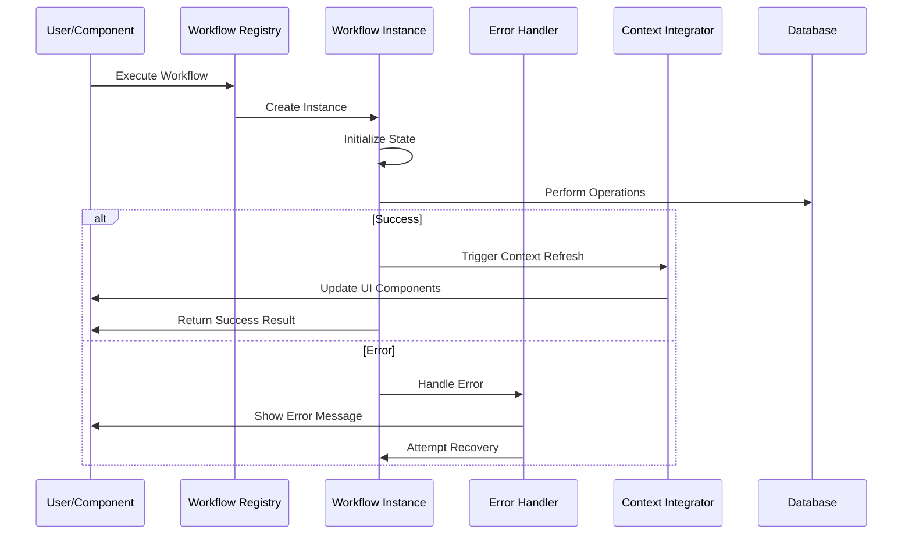

# Client-Side Workflow Architecture Design

## Overview

Plan 35 implements a comprehensive client-side workflow architecture that standardizes common patterns across all client operations. The architecture is built in `/packages/shared-imports/src/architecture/workflows` and provides reusable workflow components that encapsulate plan operations, communication flows, impact management, error handling, and context integration.

The design eliminates the traditional analysis/guidance phases in favor of comprehensive upfront planning, creating a streamlined development process that builds workflows as composable, testable units.

## Architecture

### Workflow Architecture Overview



### Workflow Execution Flow



## Components and Interfaces

### 1. Workflow Registry

The central registry manages all workflow definitions and provides a unified interface for workflow execution.

```javascript
// File: /packages/shared-imports/src/architecture/workflows/WorkflowRegistry.js
class WorkflowRegistry {
  constructor() {
    this.workflows = new Map();
    this.middleware = [];
  }

  register(name, workflowDefinition) {
    this.workflows.set(name, workflowDefinition);
  }

  async execute(workflowName, context, options = {}) {
    const definition = this.workflows.get(workflowName);
    if (!definition) {
      throw new Error(`Workflow '${workflowName}' not found`);
    }

    const instance = new WorkflowInstance(definition, context, options);
    return await instance.execute();
  }

  use(middleware) {
    this.middleware.push(middleware);
  }
}

export const workflowRegistry = new WorkflowRegistry();
```

### 2. Workflow Instance

Individual workflow execution with state management and error handling.

```javascript
// File: /packages/shared-imports/src/architecture/workflows/WorkflowInstance.js
class WorkflowInstance {
  constructor(definition, context, options) {
    this.definition = definition;
    this.context = context;
    this.options = options;
    this.state = { status: "initialized", data: {}, errors: [] };
    this.steps = [];
  }

  async execute() {
    try {
      this.state.status = "running";

      // Execute workflow steps
      for (const step of this.definition.steps) {
        await this.executeStep(step);
      }

      this.state.status = "completed";

      // Trigger context refresh if specified
      if (this.definition.contextRefresh) {
        await this.triggerContextRefresh();
      }

      return { success: true, data: this.state.data };
    } catch (error) {
      this.state.status = "failed";
      this.state.errors.push(error);

      // Handle error with recovery options
      return await this.handleError(error);
    }
  }

  async executeStep(step) {
    const stepResult = await step.execute(this.context, this.state);
    this.state.data = { ...this.state.data, ...stepResult };
    this.steps.push({
      step: step.name,
      result: stepResult,
      timestamp: new Date(),
    });
  }

  async triggerContextRefresh() {
    const { contextIntegrator } = await import("./ContextIntegrator.js");
    await contextIntegrator.refresh(
      this.definition.contextRefresh,
      this.state.data
    );
  }

  async handleError(error) {
    const { errorHandler } = await import("./ErrorHandler.js");
    return await errorHandler.handle(error, this.context, this.state);
  }
}
```

### 3. Plan Operations Workflow

Standardized patterns for plan create/update/archive operations.

```javascript
// File: /packages/shared-imports/src/architecture/workflows/plan/PlanOperationsWorkflow.js
import { workflowRegistry } from "../WorkflowRegistry.js";

const createPlanWorkflow = {
  name: "createPlan",
  steps: [
    {
      name: "validatePlanData",
      execute: async (context, state) => {
        // Validate required fields
        const { name, description, cluster } = context.planData;
        if (!name || !description || !cluster) {
          throw new Error("Missing required plan fields");
        }
        return { validatedData: context.planData };
      },
    },
    {
      name: "createPlanRecord",
      execute: async (context, state) => {
        const { execDml } = await import("@whatsfresh/shared-imports/api");

        const dmlData = {
          table: "api_wf.plans",
          method: "INSERT",
          data: {
            ...state.validatedData,
            status: "new",
            created_by: context.userID,
            active: 1,
          },
        };

        const result = await execDml("INSERT", dmlData);
        return { planId: result.insertId, planData: dmlData.data };
      },
    },
    {
      name: "initializeImpactTracking",
      execute: async (context, state) => {
        const { impactTracker } = await import("../impact/ImpactTracker.js");

        await impactTracker.recordImpact({
          planId: state.planId,
          type: "PLAN",
          description: `Plan created: ${state.planData.name}`,
          phase: "idea",
          userID: context.userID,
        });

        return { impactInitialized: true };
      },
    },
  ],
  contextRefresh: ["planList", "impactTracking"],
  errorHandling: {
    retryable: ["createPlanRecord"],
    userFriendlyMessages: {
      "Missing required plan fields":
        "Please fill in all required fields (Name, Description, Cluster)",
      "Database connection failed": "Unable to save plan. Please try again.",
    },
  },
};

const updatePlanWorkflow = {
  name: "updatePlan",
  steps: [
    {
      name: "validateUpdateData",
      execute: async (context, state) => {
        if (!context.planId) {
          throw new Error("Plan ID is required for updates");
        }
        return { planId: context.planId, updateData: context.updateData };
      },
    },
    {
      name: "updatePlanRecord",
      execute: async (context, state) => {
        const { execDml } = await import("@whatsfresh/shared-imports/api");

        const dmlData = {
          table: "api_wf.plans",
          method: "UPDATE",
          data: {
            ...state.updateData,
            updated_at: new Date().toISOString(),
            userID: context.userID,
          },
          where: { id: state.planId },
        };

        const result = await execDml("UPDATE", dmlData);
        return { updated: true, planData: dmlData.data };
      },
    },
    {
      name: "recordUpdateImpact",
      execute: async (context, state) => {
        const { impactTracker } = await import("../impact/ImpactTracker.js");

        await impactTracker.recordImpact({
          planId: state.planId,
          type: "MODIFY",
          description: `Plan updated: ${Object.keys(state.updateData).join(
            ", "
          )}`,
          phase: "development",
          userID: context.userID,
        });

        return { impactRecorded: true };
      },
    },
  ],
  contextRefresh: ["planContext", "impactTracking"],
  errorHandling: {
    retryable: ["updatePlanRecord"],
    userFriendlyMessages: {
      "Plan ID is required for updates":
        "Unable to identify which plan to update",
      "Plan not found": "The selected plan no longer exists",
    },
  },
};

const archivePlanWorkflow = {
  name: "archivePlan",
  steps: [
    {
      name: "validateArchiveRequest",
      execute: async (context, state) => {
        if (!context.planId) {
          throw new Error("Plan ID is required for archiving");
        }
        return { planId: context.planId };
      },
    },
    {
      name: "archivePlanRecord",
      execute: async (context, state) => {
        const { execDml } = await import("@whatsfresh/shared-imports/api");

        // Soft delete: set deleted_at and active=0
        const dmlData = {
          table: "api_wf.plans",
          method: "UPDATE",
          data: {
            active: 0,
            deleted_at: new Date().toISOString(),
            deleted_by: context.userID,
          },
          where: { id: state.planId },
        };

        const result = await execDml("UPDATE", dmlData);
        return { archived: true };
      },
    },
    {
      name: "recordArchiveImpact",
      execute: async (context, state) => {
        const { impactTracker } = await import("../impact/ImpactTracker.js");

        await impactTracker.recordImpact({
          planId: state.planId,
          type: "PLAN",
          description: "Plan archived (soft delete)",
          phase: "development",
          userID: context.userID,
        });

        return { impactRecorded: true };
      },
    },
  ],
  contextRefresh: ["planList", "planContext", "impactTracking"],
  errorHandling: {
    retryable: ["archivePlanRecord"],
    userFriendlyMessages: {
      "Plan ID is required for archiving":
        "Unable to identify which plan to archive",
      "Plan not found": "The selected plan no longer exists",
    },
  },
};

// Register workflows
workflowRegistry.register("createPlan", createPlanWorkflow);
workflowRegistry.register("updatePlan", updatePlanWorkflow);
workflowRegistry.register("archivePlan", archivePlanWorkflow);
```

### 4. Communication Flow Workflow

Handles message creation and agent coordination modal triggers.

```javascript
// File: /packages/shared-imports/src/architecture/workflows/communication/CommunicationWorkflow.js
import { workflowRegistry } from "../WorkflowRegistry.js";

const createCommunicationWorkflow = {
  name: "createCommunication",
  steps: [
    {
      name: "validateCommunicationData",
      execute: async (context, state) => {
        const { planId, type, subject, message, fromAgent } = context;
        if (!planId || !type || !subject || !message || !fromAgent) {
          throw new Error("Missing required communication fields");
        }
        return { communicationData: context };
      },
    },
    {
      name: "createCommunicationRecord",
      execute: async (context, state) => {
        const { execEvent } = await import("@whatsfresh/shared-imports/api");

        // Use existing createCommunication workflow
        const result = await execEvent("createCommunication", {
          ":planID": state.communicationData.planId,
          ":type": state.communicationData.type,
          ":subject": state.communicationData.subject,
          ":message": state.communicationData.message,
          ":fromAgent": state.communicationData.fromAgent,
        });

        return {
          communicationId: result.communicationId,
          recipient: result.recipient,
          details: result.details,
        };
      },
    },
    {
      name: "triggerCoordinationModal",
      execute: async (context, state) => {
        const { modalCoordinator } = await import("./ModalCoordinator.js");

        const modalData = {
          id: state.communicationId,
          plan_id: state.communicationData.planId,
          from_agent: state.communicationData.fromAgent,
          to_agent: state.recipient,
          subject: state.communicationData.subject,
          message: state.communicationData.message,
          created_at: new Date().toISOString(),
        };

        await modalCoordinator.trigger("user-issue", modalData);
        return { modalTriggered: true };
      },
    },
  ],
  contextRefresh: ["communicationHistory"],
  errorHandling: {
    retryable: ["createCommunicationRecord"],
    userFriendlyMessages: {
      "Missing required communication fields":
        "Please fill in all required fields",
      "Communication creation failed":
        "Unable to send message. Please try again.",
    },
  },
};

workflowRegistry.register("createCommunication", createCommunicationWorkflow);
```

### 5. Impact Management Workflow

Automatic impact tracking with proper categorization.

```javascript
// File: /packages/shared-imports/src/architecture/workflows/impact/ImpactTracker.js
class ImpactTracker {
  async recordImpact({
    planId,
    type,
    description,
    phase,
    userID,
    file = null,
    package = null,
  }) {
    try {
      const { execDml } = await import("@whatsfresh/shared-imports/api");

      const impactData = {
        table: "api_wf.plan_impacts",
        method: "INSERT",
        data: {
          plan_id: planId,
          type: this.validateImpactType(type),
          description,
          phase: this.validatePhase(phase),
          file,
          package,
          status: "completed",
          created_by: userID,
          created_at: new Date().toISOString(),
        },
      };

      const result = await execDml("INSERT", impactData);

      // Trigger context refresh for impact tracking components
      const { contextIntegrator } = await import("../ContextIntegrator.js");
      await contextIntegrator.refresh(["impactTracking"], {
        impactId: result.insertId,
      });

      return { success: true, impactId: result.insertId };
    } catch (error) {
      console.error("Impact tracking failed:", error);
      // Don't fail the main workflow if impact tracking fails
      return { success: false, error: error.message };
    }
  }

  validateImpactType(type) {
    const validTypes = [
      "CREATE",
      "MODIFY",
      "DELETE",
      "ANALYZE",
      "DISCOVER",
      "COMMUNICATE",
      "PLAN",
    ];
    return validTypes.includes(type) ? type : "MODIFY";
  }

  validatePhase(phase) {
    const validPhases = ["idea", "development", "adhoc"];
    return validPhases.includes(phase) ? phase : "development";
  }

  async categorizeFileChange(filePath, changeType, planId, userID) {
    // Automatic categorization based on file path and change type
    let impactType = changeType.toUpperCase();
    let phase = "development";
    let description = `${changeType} ${filePath}`;

    // Categorize based on file patterns
    if (filePath.includes("/specs/") || filePath.includes("/requirements/")) {
      phase = "idea";
      description = `${changeType} specification: ${filePath}`;
    } else if (filePath.includes("/test/") || filePath.includes(".test.")) {
      impactType = "CREATE";
      description = `${changeType} test file: ${filePath}`;
    } else if (filePath.includes("/docs/") || filePath.includes("README")) {
      impactType = "COMMUNICATE";
      description = `${changeType} documentation: ${filePath}`;
    }

    return await this.recordImpact({
      planId,
      type: impactType,
      description,
      phase,
      userID,
      file: filePath,
      package: this.extractPackageName(filePath),
    });
  }

  extractPackageName(filePath) {
    const match = filePath.match(/packages\/([^\/]+)/);
    return match ? match[1] : null;
  }
}

export const impactTracker = new ImpactTracker();
```

### 6. Error Handler

Consistent error handling patterns across all workflows.

```javascript
// File: /packages/shared-imports/src/architecture/workflows/ErrorHandler.js
class ErrorHandler {
  async handle(error, context, state) {
    const errorInfo = {
      message: error.message,
      stack: error.stack,
      context: this.sanitizeContext(context),
      state: this.sanitizeState(state),
      timestamp: new Date().toISOString(),
    };

    // Log error for debugging
    console.error("Workflow error:", errorInfo);

    // Determine if error is retryable
    const isRetryable = this.isRetryableError(error);

    // Get user-friendly message
    const userMessage = this.getUserFriendlyMessage(error);

    return {
      success: false,
      error: {
        message: userMessage,
        retryable: isRetryable,
        details: error.message,
      },
    };
  }

  isRetryableError(error) {
    const retryablePatterns = [
      /network/i,
      /timeout/i,
      /connection/i,
      /temporary/i,
    ];

    return retryablePatterns.some((pattern) => pattern.test(error.message));
  }

  getUserFriendlyMessage(error) {
    const friendlyMessages = {
      "Missing required plan fields": "Please fill in all required fields",
      "Plan ID is required": "Unable to identify the plan to update",
      "Database connection failed": "Unable to save changes. Please try again.",
      "Network error":
        "Connection problem. Please check your internet connection.",
      "Validation failed": "Please check your input and try again.",
    };

    return (
      friendlyMessages[error.message] ||
      "An unexpected error occurred. Please try again."
    );
  }

  sanitizeContext(context) {
    // Remove sensitive data from context for logging
    const sanitized = { ...context };
    delete sanitized.password;
    delete sanitized.token;
    return sanitized;
  }

  sanitizeState(state) {
    // Remove sensitive data from state for logging
    const sanitized = { ...state };
    delete sanitized.credentials;
    return sanitized;
  }
}

export const errorHandler = new ErrorHandler();
```

### 7. Context Integrator

Manages context refresh notifications across components.

```javascript
// File: /packages/shared-imports/src/architecture/workflows/ContextIntegrator.js
class ContextIntegrator {
  constructor() {
    this.refreshHandlers = new Map();
  }

  async refresh(refreshTargets, data = {}) {
    if (!Array.isArray(refreshTargets)) {
      refreshTargets = [refreshTargets];
    }

    for (const target of refreshTargets) {
      await this.refreshTarget(target, data);
    }
  }

  async refreshTarget(target, data) {
    switch (target) {
      case "planList":
        // Refresh plan selector components
        await this.triggerPlanListRefresh(data);
        break;

      case "planContext":
        // Trigger plan context refresh
        await this.triggerPlanContextRefresh(data);
        break;

      case "communicationHistory":
        // Refresh communication history components
        await this.triggerCommunicationRefresh(data);
        break;

      case "impactTracking":
        // Refresh impact tracking components
        await this.triggerImpactTrackingRefresh(data);
        break;

      default:
        console.warn(`Unknown refresh target: ${target}`);
    }
  }

  async triggerPlanListRefresh(data) {
    // Trigger refresh of SelPlan components
    const event = new CustomEvent("planListRefresh", { detail: data });
    window.dispatchEvent(event);
  }

  async triggerPlanContextRefresh(data) {
    // Use existing plan context system from Plan 34
    const { default: contextStore } = await import(
      "../../../stores/contextStore.js"
    );
    const currentPlanId = contextStore.getParameter("planID");

    if (currentPlanId) {
      // Trigger refresh by setting the same planID (will notify subscribers)
      contextStore.setParameter("planID", currentPlanId);
    }
  }

  async triggerCommunicationRefresh(data) {
    const event = new CustomEvent("communicationRefresh", { detail: data });
    window.dispatchEvent(event);
  }

  async triggerImpactTrackingRefresh(data) {
    const event = new CustomEvent("impactTrackingRefresh", { detail: data });
    window.dispatchEvent(event);
  }
}

export const contextIntegrator = new ContextIntegrator();
```

## Data Models

### Workflow Definition

```javascript
interface WorkflowDefinition {
  name: string;
  steps: WorkflowStep[];
  contextRefresh?: string[];
  errorHandling?: {
    retryable?: string[],
    userFriendlyMessages?: Record<string, string>,
  };
}

interface WorkflowStep {
  name: string;
  execute: (context: any, state: any) => Promise<any>;
}
```

### Workflow Context

```javascript
interface WorkflowContext {
  userID: string;
  planId?: string;
  [key: string]: any;
}
```

### Workflow State

```javascript
interface WorkflowState {
  status: "initialized" | "running" | "completed" | "failed";
  data: Record<string, any>;
  errors: Error[];
}
```

## Error Handling

### Error Categories

- **Validation Errors**: Missing or invalid input data
- **Network Errors**: Database connection or API failures
- **Business Logic Errors**: Workflow-specific validation failures
- **System Errors**: Unexpected runtime errors

### Recovery Patterns

- **Automatic Retry**: For transient network errors
- **User Retry**: For user-correctable errors
- **Graceful Degradation**: Continue workflow with reduced functionality
- **Rollback**: Undo partial changes on critical failures

## Testing Strategy

### Unit Tests

- Individual workflow step execution
- Error handling scenarios
- Context integration functionality
- Impact tracking accuracy

### Integration Tests

- Complete workflow execution
- Database interaction patterns
- Context refresh triggers
- Error recovery mechanisms

### End-to-End Tests

- User workflow scenarios
- Cross-component integration
- Performance under load
- Error boundary testing
