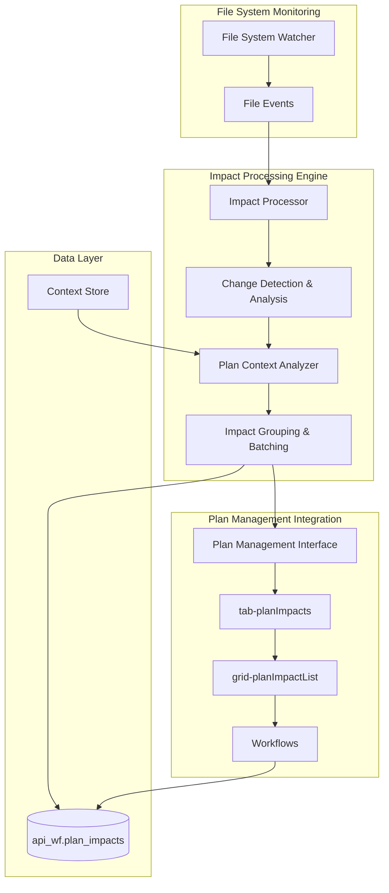

# Design Document

## Overview

The Automatic Impact Tracking system will monitor file modifications across the entire monorepo and automatically create impact records in the plan management system. The design integrates with the existing wf-plan-management app architecture, leveraging the established eventType patterns and workflow structure to provide seamless impact tracking without disrupting developer workflows.

## Architecture

### High-Level Components



### Integration with Plan Management App

The system integrates directly with the established plan management component structure:

- **tab-planImpacts**: Displays real-time impact tracking
- **grid-planImpactList**: Shows filtered impacts by planID
- **Workflows**: `trackImpact`, `updateRecord`, `createRecord` trigger impact creation
- **Context Store**: Provides plan association context

## Components and Interfaces

### 1. File System Monitor

**Purpose**: Detect file modifications across the monorepo
**Technology**: Node.js fs.watch or chokidar for cross-platform compatibility

```javascript
interface FileSystemMonitor {
  watchPaths: string[];
  excludePatterns: string[];
  debounceMs: number;

  onFileChange(event: FileChangeEvent): void;
  start(): void;
  stop(): void;
}

interface FileChangeEvent {
  type: "CREATE" | "MODIFY" | "DELETE";
  filePath: string;
  timestamp: Date;
  size?: number;
}
```

### 2. Impact Processor

**Purpose**: Analyze file changes and determine impact significance

```javascript
interface ImpactProcessor {
  processFileChange(event: FileChangeEvent): Promise<ImpactRecord[]>;
  determineAffectedApps(filePath: string): string[];
  generateDescription(event: FileChangeEvent, context: PlanContext): string;
  shouldTrackImpact(event: FileChangeEvent): boolean;
}

interface ImpactRecord {
  planId: number;
  filePath: string;
  changeType: "CREATE" | "MODIFY" | "DELETE";
  affectedApps: string[];
  description: string;
  timestamp: Date;
  userId: string;
  batchId?: string;
}
```

### 3. Plan Context Analyzer

**Purpose**: Determine plan association for impact tracking

```javascript
interface PlanContextAnalyzer {
  getCurrentPlanContext(): Promise<PlanContext | null>;
  extractPlanFromPath(filePath: string): number | null;
  extractPlanFromGuidance(): number | null;
  promptForPlanAssociation(): Promise<number | null>;
}

interface PlanContext {
  planId: number;
  planName: string;
  source: "contextStore" | "fileSystem" | "guidance" | "manual";
  confidence: number;
}
```

### 4. Cross-App Impact Analyzer

**Purpose**: Identify dependencies and cross-app impacts

```javascript
interface CrossAppAnalyzer {
  analyzeEventTypeImpacts(filePath: string): AppImpact[];
  analyzeSharedUtilityImpacts(filePath: string): AppImpact[];
  analyzeDatabaseSchemaImpacts(filePath: string): AppImpact[];
  groupRelatedChanges(impacts: ImpactRecord[]): ImpactBatch[];
}

interface AppImpact {
  appName: string;
  impactType: "direct" | "dependency" | "potential";
  severity: "low" | "medium" | "high";
  description: string;
}
```

## Data Models

### Database Schema Extensions

```sql
-- Extend existing api_wf.plan_impacts table
ALTER TABLE api_wf.plan_impacts ADD COLUMN IF NOT EXISTS batch_id VARCHAR(36);
ALTER TABLE api_wf.plan_impacts ADD COLUMN IF NOT EXISTS affected_apps JSON;
ALTER TABLE api_wf.plan_impacts ADD COLUMN IF NOT EXISTS auto_generated BOOLEAN DEFAULT FALSE;
ALTER TABLE api_wf.plan_impacts ADD COLUMN IF NOT EXISTS cross_app_analysis JSON;

-- Index for performance
CREATE INDEX IF NOT EXISTS idx_plan_impacts_batch ON api_wf.plan_impacts(batch_id);
CREATE INDEX IF NOT EXISTS idx_plan_impacts_auto ON api_wf.plan_impacts(auto_generated);
```

### EventType Integration

```javascript
// Extend existing eventTypes for impact tracking
const impactTrackingEvents = {
  trackImpact: {
    table: "plan_impacts",
    fields: [
      "plan_id",
      "file_path",
      "change_type",
      "description",
      "affected_apps",
      "batch_id",
    ],
    workflow: "trackImpact",
  },

  batchTrackImpacts: {
    table: "plan_impacts",
    fields: ["impacts_array"],
    workflow: "batchTrackImpacts",
  },
};
```

## Error Handling

### Graceful Degradation Strategy

1. **File System Monitoring Failures**

   - Log errors but continue monitoring other paths
   - Implement retry logic with exponential backoff
   - Provide manual impact tracking fallback

2. **Plan Context Resolution Failures**

   - Skip impact tracking if no context can be determined
   - Log missed opportunities for later review
   - Allow manual association through UI

3. **Database Write Failures**
   - Queue impacts for retry
   - Ensure file operations complete successfully regardless
   - Provide batch retry mechanism

### Error Recovery

```javascript
interface ErrorHandler {
  handleFileSystemError(error: Error, filePath: string): void;
  handlePlanContextError(error: Error, event: FileChangeEvent): void;
  handleDatabaseError(error: Error, impacts: ImpactRecord[]): void;
  retryFailedImpacts(): Promise<void>;
}
```

## Testing Strategy

### Unit Testing

- **File System Monitor**: Mock file system events, test debouncing
- **Impact Processor**: Test change type detection, description generation
- **Plan Context Analyzer**: Test context resolution from various sources
- **Cross-App Analyzer**: Test dependency detection accuracy

### Integration Testing

- **End-to-End Impact Flow**: File change → impact record creation
- **Plan Management UI Integration**: Real-time impact display
- **Workflow Integration**: Impact creation through existing workflows
- **Database Integration**: Impact record persistence and retrieval

### Performance Testing

- **High-Volume File Changes**: Test debouncing and batching
- **Large Monorepo Monitoring**: Test file system watcher performance
- **Database Write Performance**: Test batch impact insertion
- **UI Responsiveness**: Test real-time impact display performance

## Code Generation Automation

### Workflow Configuration Generation

As part of the MVP completion, implement automated generation of workflow configurations to replace legacy pageMap files with modern, co-located workflow definitions.

#### genDirectives Automation

**Purpose**: Extract UI directives from plan-management eventTypes and database schema
**Location**: `analysis-n-document/scripts/genOps/genDirectivesPlanMgmt.js`

```javascript
interface DirectivesGenerator {
  // EventType Analysis
  extractPlanEventTypes(): EventType[];
  analyzeFormRequirements(eventType: EventType): FormDirectives;
  analyzeCRUDOperations(eventType: EventType): CRUDDirectives;

  // Database Schema Analysis
  analyzeDatabaseTables(tablePath: string): TableSchema[];
  extractFieldConstraints(tableSchema: TableSchema): FieldConstraint[];
  mapForeignKeyRelationships(tableSchema: TableSchema): RelationshipMap[];

  // Combined Analysis
  combineEventTypeAndSchema(
    eventType: EventType,
    tableSchema: TableSchema
  ): EnhancedDirectives;
  generateUIDirectives(
    enhancedDirectives: EnhancedDirectives[]
  ): DirectiveConfig[];

  // Output: plan-specific directive configurations
  outputPath: "analysis-n-document/output/json/plan-directives.json";
}

interface TableSchema {
  tableName: string;
  fields: DatabaseField[];
  primaryKeys: string[];
  foreignKeys: ForeignKeyRelation[];
  indexes: IndexDefinition[];
}

interface DatabaseField {
  name: string;
  type: string; // VARCHAR, INT, BOOLEAN, DATETIME, etc.
  nullable: boolean;
  maxLength?: number;
  defaultValue?: any;
  constraints: string[];
}

interface FieldConstraint {
  fieldName: string;
  validationType: "required" | "maxLength" | "minLength" | "pattern" | "range";
  validationValue: any;
  uiInputType: "text" | "number" | "date" | "boolean" | "select" | "textarea";
}

interface RelationshipMap {
  localField: string;
  foreignTable: string;
  foreignField: string;
  relationshipType: "one-to-one" | "one-to-many" | "many-to-one";
  selectorComponent: string; // e.g., 'SelPlan', 'SelAcct'
}
```

**Database Analysis Sources:**

- **Tables**: `/sql/database/api_wf/tables/` - API table definitions
- **Views**: `/sql/database/api_wf/views/` - List view definitions
- **Core Tables**: `/sql/database/whatsfresh/tables/` - Core business tables

**Enhanced Directive Generation:**

1. **Field Type Mapping**: Database types → UI input components
2. **Validation Rules**: Database constraints → Form validation
3. **Relationship Selectors**: Foreign keys → Dropdown components
4. **Default Values**: Database defaults → Form field defaults
5. **Required Fields**: NOT NULL constraints → Required validation

#### Template System & Update Strategy

**Template Management:**

```javascript
interface TemplateSystem {
  workflowTemplate: string; // Template for workflow.js structure
  displayTemplate: string; // Template for display.js structure
  preserveZoneMarkers: string[]; // How to identify manual zones
  templateDirectory: "analysis-n-document/templates/genOps";
}

interface UpdateStrategy {
  detectExistingFiles(): boolean;
  mergeNewFields(existing: Config, generated: Config): Config;
  backupBeforeRegeneration(): void;
  preserveManualZones(existingFile: string, newContent: string): string;
}

interface ValidationStrategy {
  validateGeneratedSyntax(filePath: string): boolean;
  testImportability(filePath: string): boolean;
  validateZoneIntegrity(filePath: string): boolean;
}
```

**Generator Configuration:**

```javascript
const generatorConfig = {
  planManagementPath: "apps/wf-plan-management/src/pages",
  templateDirectory: "analysis-n-document/templates/genOps",
  preserveMarkers: [
    "// 🤖 AUTO-GENERATED ZONE - Safe to regenerate",
    "// ✋ MANUAL CUSTOMIZATION ZONE - Never overwrite",
  ],
  backupDirectory: "analysis-n-document/backups/genOps",
  databasePaths: {
    apiTables: "/sql/database/api_wf/tables/",
    apiViews: "/sql/database/api_wf/views/",
    coreTables: "/sql/database/whatsfresh/tables/",
  },
};
```

**Regeneration Workflow:**

1. **Detect existing files** and backup manual zones
2. **Analyze changes** in eventTypes and database schema
3. **Merge new fields** into auto-generated zones only
4. **Preserve manual customizations** in designated zones
5. **Validate syntax** and importability of generated files
6. **Create backup** before applying changes

#### genWorkflows Automation

**Purpose**: Generate co-located workflow.js and display.js files for each plan-management page
**Location**: `analysis-n-document/scripts/genOps/genWorkflowsPlanMgmt.js`

```javascript
interface WorkflowsGenerator {
  combineEventTypesAndDirectives(
    eventTypes: EventType[],
    directives: DirectiveConfig[]
  ): WorkflowSpec[];
  generatePageConfigurations(
    workflowSpecs: WorkflowSpec[]
  ): PageConfiguration[];
  createColocatedFiles(configurations: PageConfiguration[]): void;

  // Output: apps/wf-plan-management/src/pages/*/workflow.js
  // Output: apps/wf-plan-management/src/pages/*/display.js
  outputPattern: "apps/wf-plan-management/src/pages/{page}/{workflow|display}.js";
}

interface PageConfiguration {
  pageName: string;
  eventType: string;
  workflow: WorkflowConfig;
  display: DisplayConfig;
}

interface WorkflowConfig {
  eventType: string;
  dbTable: string;
  operations: CRUDOperations;
  statusTransitions: StatusConfig;
  businessValidation: ValidationConfig;
}

interface DisplayConfig {
  fieldGroups: FieldGroupConfig;
  columnConfig: ColumnConfig;
  formLayout: FormLayoutConfig;
  gridConfig: GridConfig;
}
```

#### Co-located Configuration Structure

```
apps/wf-plan-management/src/pages/
├── planList/
│   ├── index.jsx
│   ├── workflow.js        # Business logic & operations
│   └── display.js         # UI configuration & layout
├── planDetail/
│   ├── index.jsx
│   ├── workflow.js        # Business logic & operations
│   └── display.js         # UI configuration & layout
└── communicationList/
    ├── index.jsx
    ├── workflow.js        # Business logic & operations
    └── display.js         # UI configuration & layout
```

#### Dual-Zone Configuration Pattern

Each generated configuration file uses a dual-zone approach to balance automation with customization:

**workflow.js Structure:**

```javascript
// 🤖 AUTO-GENERATED ZONE - Safe to regenerate
export const workflow = {
  eventType: "planDetail",
  dbTable: "plans",
  fields: [...], // From eventType analysis
  operations: {
    create: { endpoint: "/api/plans", method: "POST" },
    read: { endpoint: "/api/plans/:id", method: "GET" },
    update: { endpoint: "/api/plans/:id", method: "PUT" },
    delete: { endpoint: "/api/plans/:id", method: "DELETE" }
  }
};

// ✋ MANUAL CUSTOMIZATION ZONE - Never overwrite
export const customWorkflow = {
  businessValidation: {
    // Custom validation rules specific to business logic
  },
  statusTransitions: {
    // Manual status workflow definitions
  },
  customOperations: {
    // Business-specific operations beyond basic CRUD
  }
};
```

**display.js Structure:**

```javascript
// 🤖 AUTO-GENERATED ZONE - Safe to regenerate
export const display = {
  fields: [...], // From eventType field analysis
  defaultLayout: {
    // Generated form and grid layouts
  },
  baseValidation: {
    // Field-level validation from eventType
  }
};

// ✋ MANUAL CUSTOMIZATION ZONE - Never overwrite
export const customDisplay = {
  fieldGroups: {
    // Manual field groupings for forms
  },
  columnConfig: {
    // Manual column widths, hide/show preferences
  },
  formLayout: {
    // Custom form organization and UX decisions
  },
  gridConfig: {
    // Custom grid behavior and styling
  }
};
```

**Benefits of Dual-Zone Pattern:**

- **Safe Regeneration**: Auto zones can be updated without losing customizations
- **Progressive Enhancement**: Start with scaffolding, evolve with real usage
- **Clear Boundaries**: Developers know exactly where they can customize
- **UX Preservation**: Hard-won UX discoveries are protected from regeneration

#### Integration with EventTypes Architecture

- Leverage existing modular eventTypes structure
- Follow plan eventTypes patterns established in `/packages/shared-imports/src/events/plans/`
- Ensure compatibility with existing server-side eventType resolution
- Generate workflows that align with current plan management data models
- Align with existing display config patterns (like `ingrList.display.js`)

## Implementation Phases

### Phase 1: Core Infrastructure & Code Generation

- File system monitoring setup
- Basic impact processor
- Database schema extensions
- Simple plan context resolution
- **genDirectives automation for plan-management**
- **genWorkflows co-located file generation**

### Phase 2: Plan Management Integration

- tab-planImpacts component integration
- grid-planImpactList real-time updates
- Workflow-triggered impact tracking
- Context store integration

### Phase 3: Advanced Features

- Cross-app impact analysis
- Impact batching and grouping
- Advanced plan context resolution
- Performance optimizations

### Phase 4: Polish and Optimization

- Error handling refinement
- Performance tuning
- User experience improvements
- Comprehensive testing

## Configuration and Deployment

### Configuration Options

```javascript
const impactTrackingConfig = {
  enabled: true,
  watchPaths: ["/apps/**", "/packages/**", "/sql/**"],
  excludePatterns: ["node_modules/**", ".git/**", "**/*.log"],
  debounceMs: 1000,
  batchTimeoutMs: 5000,
  maxBatchSize: 50,
};
```

### Deployment Considerations

- **Development Environment**: Full monitoring with detailed logging
- **Production Environment**: Optimized monitoring with error alerting
- **Performance Impact**: Minimal overhead on file operations
- **Scalability**: Handle large monorepo with thousands of files
