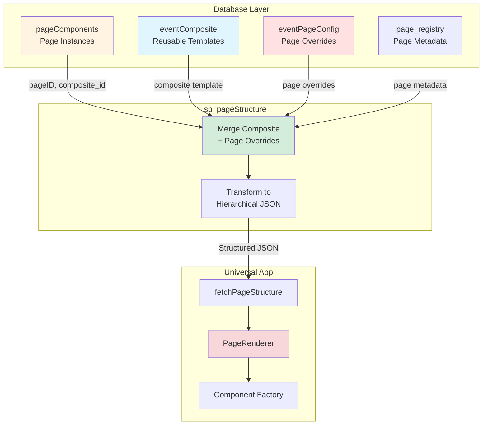
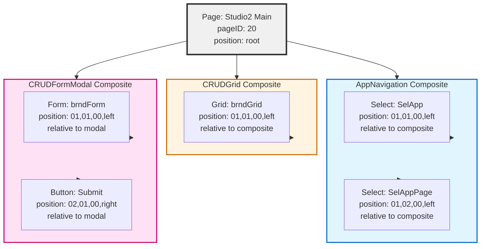
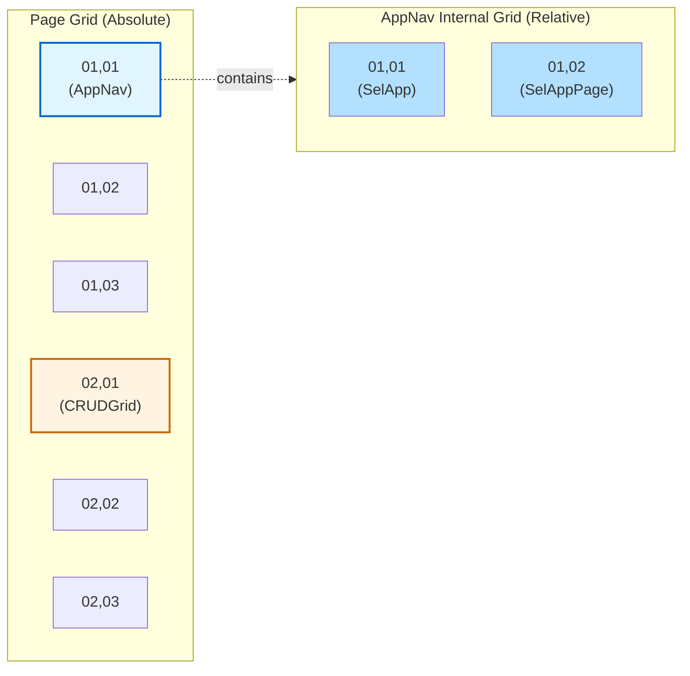
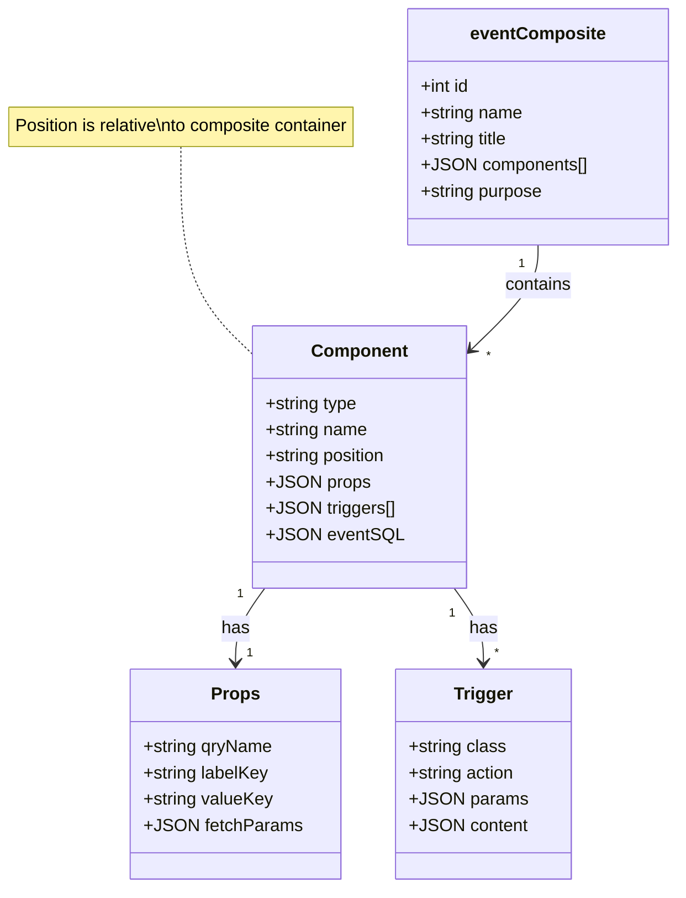
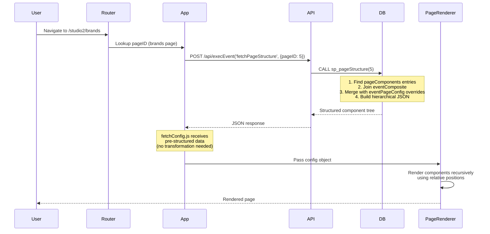

# Composite Architecture - Visual Diagrams

## 1. Data Flow Architecture



## 2. Composite Hierarchy - Page Structure



## 3. Position Coordinate System - Relative Positioning



## 4. Data Structure - eventComposite



## 5. sp_pageStructure Output Structure

```mermaid
graph TB
    subgraph Output["sp_pageStructure Returns"]
        PAGE_META[Page Metadata<br/>pageID, pageName, appName]

        subgraph COMPONENTS["components: []"]
            COMP1[Component Object]
            COMP2[Component Object]
            COMP3[Component Object]
        end
    end

    subgraph ComponentObject["Component Structure"]
        ID[id: comp_name]
        TYPE[comp_type: Select]
        POS[position: {row, order, width, align}]
        PROPS[props: {qryName, labelKey...}]
        TRIGS[workflowTriggers: {onClick: [...]}]
        CHILDREN[components: [nested children]]
    end

    PAGE_META --> COMPONENTS
    COMPONENTS --> COMP1
    COMPONENTS --> COMP2
    COMPONENTS --> COMP3

    COMP1 -.structure.-> ComponentObject

    style Output fill:#d4edda
    style ComponentObject fill:#fff3cd
```

## 6. Request Flow - From URL to Render



## 7. Composite Types - Reusable vs Instance-Specific

```mermaid
graph TB
    subgraph Reusable["Reusable Composites (Complete Config)"]
        NAV[AppNavigation<br/>✓ props<br/>✓ triggers<br/>✓ eventSQL]
        ACTIONS[CRUDActions<br/>✓ props<br/>✓ triggers<br/>✓ eventSQL]
        LOGIN[LoginForm<br/>✓ props<br/>✓ triggers<br/>✓ eventSQL]
    end

    subgraph Templates["Template Composites (Require Overrides)"]
        GRID[CRUDGrid<br/>○ props: null<br/>○ eventSQL: null]
        FORM[CRUDForm<br/>○ props: null<br/>○ eventSQL: null]
    end

    subgraph PageOverrides["eventPageConfig (Page-Specific Data)"]
        BRAND_GRID[brndGrid Override<br/>✓ props: {qryName}<br/>✓ eventSQL: SELECT...]
        PLAN_FORM[plansForm Override<br/>✓ props: {formFields}<br/>✓ eventSQL: SELECT...]
    end

    NAV -.used as-is.-> PAGE1[Brands Page]
    NAV -.used as-is.-> PAGE2[Plans Page]

    GRID -.requires.-> BRAND_GRID
    BRAND_GRID --> PAGE1

    FORM -.requires.-> PLAN_FORM
    PLAN_FORM --> PAGE2

    style Reusable fill:#e1f5ff
    style Templates fill:#fff4e1
    style PageOverrides fill:#ffe1e1
```

## Key Takeaways

1. **Relative Positioning**: All positions are relative to their immediate container
2. **Two-Level System**: Composite templates + page overrides
3. **sp_pageStructure Does Heavy Lifting**: Merges, transforms, structures data
4. **PageRenderer Simplified**: Receives ready-to-render hierarchical JSON
5. **Composites Are Containers**: Each maintains its own coordinate grid

---

_These diagrams support Plan 75: Composite Architecture Infrastructure_
