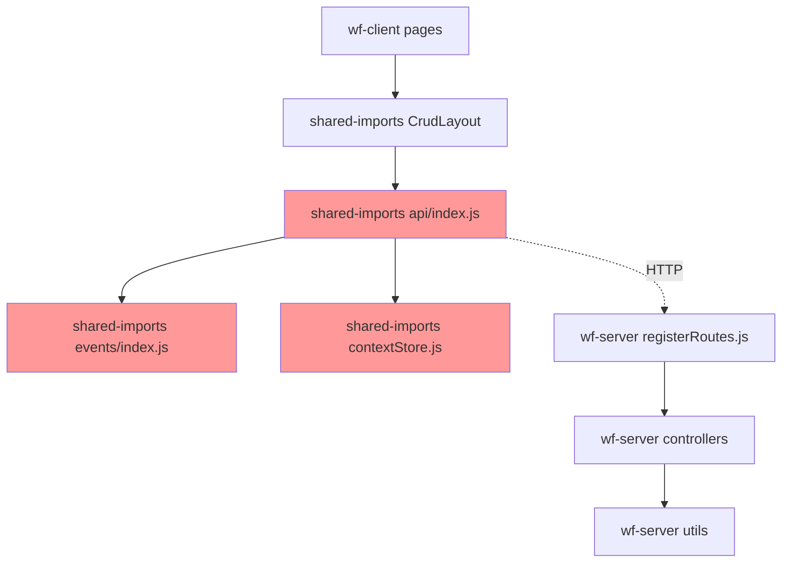
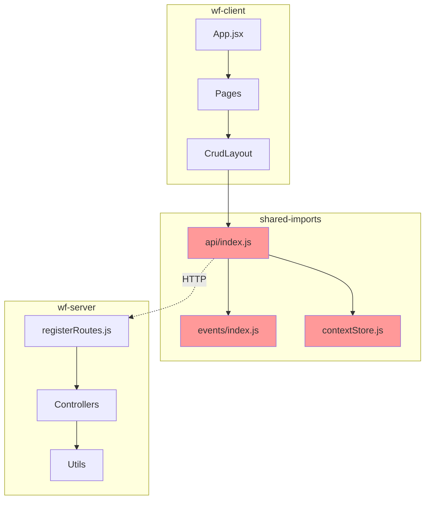
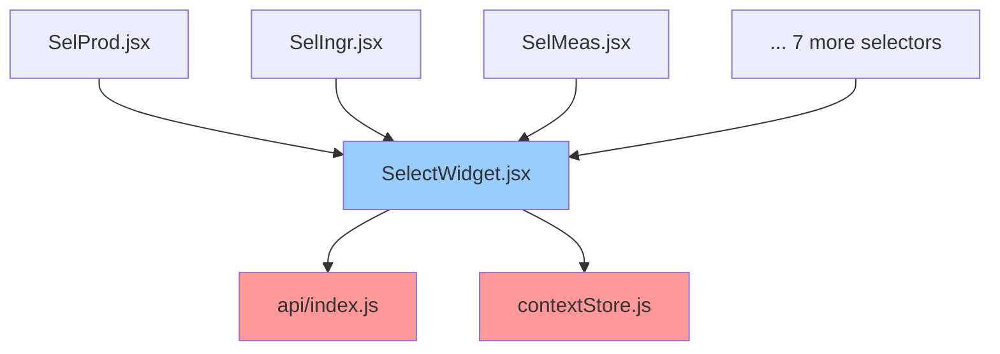
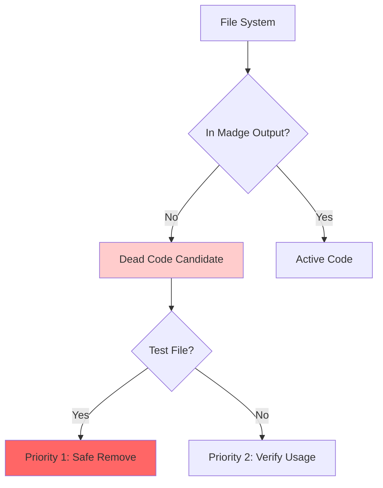

.kiro/specs/0015-architectural-intelligence/architectural-analysis.md

# Architectural Analysis - Madge Dependency Intelligence

**Plan:** 0015 - CLIENT Cleanup & Architectural Intelligence  
 **Analyst:** Claude  
 **Target:** Kiro Implementation  
 **Date:** 2025-07-21

## Executive Summary

**Comprehensive dependency analysis of WhatsFresh monorepo reveals:**

- **188 total files** analyzed across client/server/shared-imports
- **15 critical dependency nodes** requiring careful modification
- **~30 dead code files** safe for removal
- **Clear architectural patterns** for AI navigation and user visualization  


## Critical Dependency Nodes Analysis

### Tier 1: Highest Impact (8+ dependents)

```javascript
// These files affect the most other files - highest blast radius
"packages/shared-imports/src/api/index.js": 8 dependents
  ├─ Core API hub - all data operations flow through this
  ├─ Dependencies: events/index.js, stores/contextStore.js
  ├─ Blast Radius: CRITICAL - affects all CRUD, selectors, grids
  └─ Modification Risk: HIGH
```

### Tier 2: High Impact (4-7 dependents)

```javascript
"packages/shared-imports/src/events/index.js": 5 dependents
  ├─ Event system central hub
  ├─ Used by: api/index.js, auth.jsx, createSelectWidget.jsx, contextStore.js
  ├─ Blast Radius: HIGH - affects data flow and UI components
  └─ Modification Risk: HIGH

"packages/shared-imports/src/stores/contextStore.js": 4 dependents
  ├─ Universal parameter resolution and session state
  ├─ Used by: api/index.js, Form.jsx, SelectWidget.jsx, contextStore index
  ├─ Blast Radius: HIGH - affects all forms and data operations
  └─ Modification Risk: HIGH
```

### Tier 3: Medium Impact (2-3 dependents)

```javascript
"packages/shared-imports/src/components/crud/CrudLayout/CrudLayout.jsx": 3 dependents
"packages/shared-imports/src/components/selectors/SelectWidget.jsx": 8 dependents (via selector chain)
"packages/shared-imports/src/utils/logger.js": 11 direct dependents
"apps/wf-server/server/utils/logger.js": 9 direct dependents
```

## Cross-Package Dependency Flow

### Client → Shared-Imports → Server Flow



### Widget Architecture Pattern

```javascript
// Consistent pattern across all selectors
SelProd.jsx → SelectWidget.jsx → api/index.js + contextStore.js
SelIngr.jsx → SelectWidget.jsx → api/index.js + contextStore.js
SelMeas.jsx → SelectWidget.jsx → api/index.js + contextStore.js
// Pattern repeats for all 10 selector widgets
```

## Dead Code Analysis

### Priority 1: Immediate Safe Removal (Zero Dependencies)

```javascript
// Test artifacts
"apps/wf-client/src/App.test.jsx": []
"apps/wf-client/src/TestMonorepo.jsx": []

// Empty/broken files
"apps/wf-client/src/stores/eventStore.js": []
"apps/wf-client/src/utils/entityHelpers.js": []
"apps/wf-client/src/utils/runtimeRoutes.js": []

// Server test files with dependencies but unused in production
"apps/wf-server/server/utils/dml/__tests__/dmlProcessor.test.js": []
```

### Priority 2: Page Components Not in Dependency Graph

```javascript
// These page components exist but aren't imported anywhere
"apps/wf-client/src/pages/ingrTypeList/index.jsx": [] // NOT in madge
"apps/wf-client/src/pages/vndrList/index.jsx": [] // NOT in madge
"apps/wf-client/src/pages/measList/index.jsx": [] // NOT in madge
"apps/wf-client/src/pages/brndList/index.jsx": [] // NOT in madge
"apps/wf-client/src/pages/prodList/index.jsx": [] // NOT in madge
"apps/wf-client/src/pages/prodTypeList/index.jsx": [] // NOT in madge
"apps/wf-client/src/pages/prodBtchList/index.jsx": [] // NOT in madge
"apps/wf-client/src/pages/taskList/index.jsx": [] // NOT in madge
"apps/wf-client/src/pages/ingrList/index.jsx": [] // NOT in madge
"apps/wf-client/src/pages/wrkrList/index.jsx": [] // NOT in madge
"apps/wf-client/src/pages/rcpeList/index.jsx": [] // NOT in madge
"apps/wf-client/src/pages/userLogin/index.jsx": [] // NOT in madge
"apps/wf-client/src/pages/ingrBtchList/index.jsx": [] // NOT in madge
"apps/wf-client/src/pages/btchMapping/index.jsx": [] // NOT in madge

// However, their pageMap.js files ARE config-only (no dependencies) - KEEP THESE
```

### Safe Modification Zones (No Dependencies)

```javascript
// Pure configuration files - safe to modify
"apps/wf-client/src/config/appbar.js": []
"apps/wf-client/src/config/navigation.js": []
"apps/wf-client/src/config/routes.js": []
"apps/wf-client/src/config/settings.js": []

// All pageMap.js files - pure configuration
"apps/wf-client/src/pages/*/pageMap.js": [] // Pattern across all pages
```

## Server-Side Architecture Analysis

### Server Entry Point Flow

```javascript
"apps/wf-server/server/server.js": [
  "apps/wf-server/server/app.js",           // Main Express app
  "apps/wf-server/server/routes/index.js", // Route registration
  "apps/wf-server/server/utils/dbManager.js", // Database connection
  "apps/wf-server/server/utils/logger.js"  // Server logging
]
```

### Controller Pattern

```javascript
"apps/wf-server/server/routes/registerRoutes.js": [
  // All controllers follow same pattern - thin controllers, thick utils
  "apps/wf-server/server/controller/execDML.js",
  "apps/wf-server/server/controller/execEventType.js",
  "apps/wf-server/server/controller/userLogin.js",
  // ... 7 total controllers, all with logger dependency
]
```

### DML Processing Architecture

```javascript
"apps/wf-server/server/controller/execDML.js": [
  "apps/wf-server/server/utils/dml/dmlProcessor.js", // Business logic
  "apps/wf-server/server/utils/logger.js"
]

"apps/wf-server/server/utils/dml/dmlProcessor.js": [
  "apps/wf-server/server/utils/dbUtils.js",        // Database operations
  "apps/wf-server/server/utils/dml/sqlBuilder.js", // SQL generation
  "apps/wf-server/server/utils/executeEventType.js", // Event integration
  "apps/wf-server/server/utils/logger.js"
]
```

## Architectural Patterns Discovered

### 1. Widget System Consistency

- **All selectors** follow identical dependency pattern
- **SelectWidget.jsx** is the single implementation shared by 10+ widgets
- **api/index.js + contextStore.js** are universal dependencies  


### 2. Configuration-Driven UI

- **PageMap files** have zero dependencies (pure configuration)
- **Config files** are leaf nodes (no imports, only imported by others)
- **Clear separation** between configuration and implementation  


### 3. Thin Controller Pattern

- **Server controllers** are minimal wrappers around utils
- **Business logic** lives in utils/ directory
- **Consistent logging** through every operation  


### 4. Cross-Package Isolation

- **No direct client→server dependencies** (HTTP boundary)
- **shared-imports** serves as bridge between client and data
- **Clean package separation** enables independent deployment  


## AI Navigation Intelligence

### Investigation Shortcuts by Blast Radius

```javascript
// HIGH BLAST RADIUS - investigate carefully, coordinate changes
criticalNodes: [
  "packages/shared-imports/src/api/index.js", // 8 dependents
  "packages/shared-imports/src/events/index.js", // 5 dependents
  "packages/shared-imports/src/stores/contextStore.js", // 4 dependents
];

// MEDIUM BLAST RADIUS - package-specific impact
mediumImpact: [
  "packages/shared-imports/src/components/crud/CrudLayout/CrudLayout.jsx", // 3 dependents
  "packages/shared-imports/src/components/selectors/SelectWidget.jsx", // Widget backbone
  "apps/wf-server/server/routes/registerRoutes.js", // Server routing hub
];

// LOW BLAST RADIUS - safe modification zones
safeZones: [
  "apps/wf-client/src/pages/*/pageMap.js", // Configuration only
  "apps/wf-client/src/config/*.js", // Pure config
  "apps/wf-client/src/utils/*", // Client utilities
];
```

### Common Investigation Patterns

```javascript
// Widget Issues: Check SelectWidget.jsx first
// Form Problems: api/index.js → contextStore.js → FormStore.js
// Server Errors: registerRoutes.js → controller → utils
// Dead Pages: Check if index.jsx exists in madge output
```

## Mermaid Chart Generation Requirements

### 1. High-Level Architecture Flow



### 2. Widget System Visualization



### 3. Dead Code Identification



## Implementation Specification for Kiro

### Phase 1: Enhanced path-classes.js

```javascript
// claude-plans/config/path-classes.js
import madgeData from "../../madge-full.json";

export const getArchitecturalIntel = () => {
  // Analyze madge data and provide AI-consumable functions

  const dependentCounts = calculateDependentCounts(madgeData);
  const crossPackageDeps = identifyCrossPackageDependencies(madgeData);
  const deadCode = identifyDeadCode(madgeData);

  return {
    // Core Analysis
    getCriticalNodes: () => dependentCounts.filter((d) => d.count >= 4),
    getBlastRadius: (filePath) => assessBlastRadius(filePath, dependentCounts),
    getDependents: (filePath) => findDependents(filePath, madgeData),
    getDeadCode: () => deadCode,

    // Cross-package analysis
    getCrossPackageDependencies: () => crossPackageDeps,
    getPackageIsolation: () => assessPackageIsolation(madgeData),

    // AI Navigation
    getInvestigationPaths: (cluster) => getPathsByCluster(cluster),
    getSafeModificationZones: () =>
      dependentCounts.filter((d) => d.count === 0),

    // Visualization
    generateMermaidChart: (type) => generateMermaid(type, madgeData),
    generateDependencyReport: () =>
      generateReport(dependentCounts, crossPackageDeps, deadCode),
  };
};

// Helper functions to implement:
function calculateDependentCounts(madgeData) {
  /* Count reverse dependencies */
}
function identifyCrossPackageDependencies(madgeData) {
  /* Find client→shared→server flows */
}
function identifyDeadCode(madgeData) {
  /* Compare filesystem to madge output */
}
function assessBlastRadius(filePath, dependentCounts) {
  /* Risk assessment */
}
function generateMermaid(type, madgeData) {
  /* Mermaid chart generation */
}
```

### Phase 2: Dashboard Component

```jsx
// apps/wf-client/src/components/architecture/ArchDashboard.jsx
import { getArchitecturalIntel } from "../../../claude-plans/config/path-classes.js";

export const ArchDashboard = () => {
  const intel = getArchitecturalIntel();

  return (
    <Grid container spacing={3}>
      {/* Critical Nodes */}
      <Grid item xs={12} md={6}>
        <CriticalNodesCard nodes={intel.getCriticalNodes()} />
      </Grid>

      {/* Dead Code Report */}
      <Grid item xs={12} md={6}>
        <DeadCodeCard files={intel.getDeadCode()} />
      </Grid>

      {/* Dependency Visualization */}
      <Grid item xs={12}>
        <MermaidVisualization chart={intel.generateMermaidChart("overview")} />
      </Grid>

      {/* Cross-Package Dependencies */}
      <Grid item xs={12}>
        <CrossPackageFlow deps={intel.getCrossPackageDependencies()} />
      </Grid>
    </Grid>
  );
};
```

### Phase 3: Integration Points

#### Update steering.yaml

```yaml
# Reference architectural intelligence
architectural_intelligence: "claude-plans/config/path-classes.js"
madge_analysis: "madge-full.json"

# AI Investigation shortcuts
critical_nodes:
  - "packages/shared-imports/src/api/index.js" # 8 dependents
  - "packages/shared-imports/src/stores/contextStore.js" # 4 dependents

safe_zones:
  - "apps/wf-client/src/pages/*/pageMap.js" # Configuration only
  - "apps/wf-client/src/config/*.js" # Pure config
```

#### Add to Dashboard Navigation

```javascript
// apps/wf-client/src/config/navigation.js
// Temporary addition until admin app ready
{
  path: "/architecture",
  label: "Architecture Intel",
  component: "ArchDashboard",
  temporary: true, // Remove when admin app ready
  access: "dev"    // Development only
}
```

## Success Criteria

### For Kiro Implementation

- [ ] **path-classes.js** provides accurate critical node identification
- [ ] **Mermaid charts** render correctly with proper highlighting
- [ ] **Dashboard component** displays in wf-client without breaking existing functionality
- [ ] **Dead code identification** matches manual analysis (>90% accuracy)
- [ ] **AI functions** return consistent, queryable architectural data  


### For Dead Code Cleanup

- [ ] **Priority 1 files** (test artifacts, empty files) removed safely
- [ ] **Priority 2 files** (page components) verified against routing before removal
- [ ] **No broken imports** after cleanup
- [ ] **Application functionality** unchanged after cleanup  


### For Ongoing Intelligence

- [ ] **Madge analysis** can be re-run to update architectural data
- [ ] **AI agents** can query architectural intelligence for investigation guidance
- [ ] **User visualization** provides valuable insights into system architecture
- [ ] **Admin app integration** path established for future migration  

