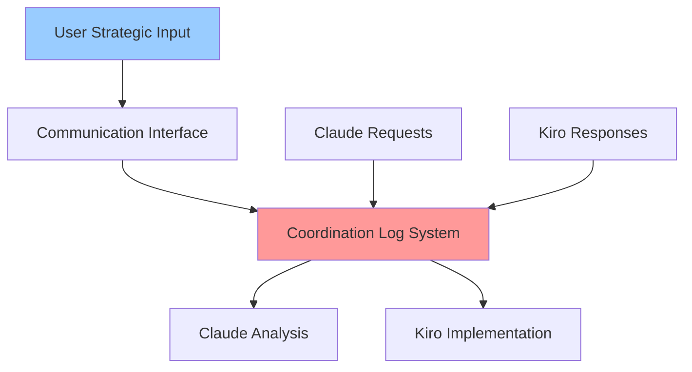

# Architectural Analysis - User Communication Interface System
**Plan:** 0016 - DEVTOOLS User Communication Interface  
**Analyst:** Claude  
**Target:** Kiro Implementation  
**Date:** 2025-07-22

## Executive Summary

**Comprehensive user interface enhancement to integrate user strategic input into the AI collaboration system:**
- **Three-tab command center** for complete project management
- **Strategic communication bridge** between User ↔ Claude ↔ Kiro workflow  
- **Consolidated development tools** in unified dashboard interface
- **Admin app migration ready** architecture for future scalability

## System Architecture Requirements

### Core Interface Structure

**Location:** Enhancement of existing `/architecture` dashboard  
**Pattern:** Tabbed interface with distinct functional areas

#### Tab 1: Plan Communication
```javascript
// Strategic user input interface
<PlanCommunicationTab>
  - Active coordination review panel
  - User strategic input forms
  - AI collaboration status display  
  - Communication history timeline
  - Decision point flagging system
</PlanCommunicationTab>
```

#### Tab 2: Plan Tools  
```javascript
// CLI tools integration
<PlanToolsTab>
  - create-plan.js interface (form-driven)
  - complete-plan.js interface  
  - Plan status management
  - Impact tracking viewer/editor
  - Plan dependency visualization
</PlanToolsTab>
```

#### Tab 3: Structure Relationships
```javascript
// Existing madge architectural intelligence (rename)
<StructureRelationshipsTab>
  - Dependency analysis (current dashboard)
  - Critical nodes visualization  
  - Dead code identification
  - Cross-package flow diagrams
</StructureRelationshipsTab>
```

## Technical Implementation Requirements

### 1. User Communication System Architecture

**Core Challenge:** Bridge the AI-to-AI communication system with user strategic input

#### Communication Flow Integration


#### User Identity Integration
```javascript
// Extend coordination-log.json structure
{
  "communications": [
    {
      "id": "009",
      "timestamp": "2025-07-22T10:00:00Z",
      "type": "strategic-input",
      "from": "user",          // New identifier
      "to": "claude",
      "subject": "Priority Change Request",
      "status": "pending-claude-response",
      "user_context": {
        "decision_type": "priority_shift",
        "business_impact": "high",
        "timeline_constraint": "immediate"
      }
    }
  ]
}
```

### 2. Plan Tools Interface Requirements

**Challenge:** Convert CLI tools to web interface while maintaining functionality

#### Form-Based Plan Creation
```javascript
// Replace: node create-plan.js CLUSTER "Plan Name"
// With: Web form interface
<CreatePlanForm>
  <ClusterSelector options={VALID_CLUSTERS} />
  <PlanNameInput validation={nameValidation} />
  <BlastRadiusDisplay cluster={selectedCluster} />
  <SubmitButton onClick={createPlanHandler} />
</CreatePlanForm>

// Backend integration
const createPlanHandler = async (formData) => {
  // Call existing create-plan.js functions
  const result = await createPlanAPI({
    cluster: formData.cluster,
    name: formData.planName
  });
  // Update UI with results
  refreshPlanList();
};
```

#### Plan Status Management Interface
```javascript
<PlanStatusGrid>
  - Plan listing with inline status controls
  - Complete plan functionality (form-driven)
  - Impact tracking editor
  - Plan dependency visualizer
  - Bulk operations support
</PlanStatusGrid>
```

### 3. Integration with Existing Architecture

#### Shared-Imports Integration
```javascript
// packages/shared-imports/src/architecture/components/
├── UserCommunicationInterface.jsx    // New - strategic input forms
├── PlanToolsInterface.jsx           // New - CLI tools web interface  
├── ArchDashboard.jsx                // Enhanced - tabbed container
└── CommunicationHistory.jsx         // New - coordination timeline
```

#### API Integration Requirements
```javascript
// New API endpoints needed
/api/communication/user-input        // Submit strategic input
/api/plans/create                    // Web-based plan creation
/api/plans/status/:planId           // Update plan status
/api/coordination/active            // Get pending user decisions
```

## Strategic Communication Patterns

### User Input Categories

#### 1. Strategic Decision Points
- **Priority changes:** "Focus on Plan X instead of Plan Y"
- **Scope modifications:** "Add requirement Z to current plan"
- **Timeline adjustments:** "This needs to be done by [date]"
- **Quality gates:** "Don't proceed until I review X"

#### 2. Architectural Guidance
- **Design preferences:** "Use approach A instead of approach B"
- **Integration constraints:** "Must work with existing system X"
- **Business context:** "This affects customer workflow Y"

#### 3. Resource Allocation
- **AI agent coordination:** "Claude focus on analysis, Kiro implement"
- **Effort prioritization:** "Spend more time on architecture, less on polish"
- **Blocking resolution:** "I'll handle external dependency X"

### Communication Interface Design

#### Strategic Input Form
```javascript
<StrategyInputForm>
  <InputType options={['priority_change', 'scope_modification', 'architectural_guidance']} />
  <TargetPlan planSelector={activePlans} />
  <BusinessContext textarea={contextDescription} />
  <TimelineSensitivity urgency={['immediate', 'next_session', 'flexible']} />
  <AITargeting audience={['claude', 'kiro', 'both']} />
</StrategyInputForm>
```

#### Decision Queue Management
```javascript
<PendingDecisions>
  - Items awaiting user input
  - AI agent questions requiring business context
  - Architectural trade-offs needing user preference
  - Timeline conflicts requiring priority resolution
</PendingDecisions>
```

## Migration Architecture (Admin App Ready)

### Modular Component Design
```javascript
// Design for easy migration
const AdminProjectCenter = {
  tabs: [
    { id: 'communication', component: UserCommunicationInterface },
    { id: 'tools', component: PlanToolsInterface },
    { id: 'architecture', component: StructureRelationshipsTab }
  ],
  // Easy to lift and shift to admin app
  migratable: true,
  dependencies: ['@whatsfresh/shared-imports/architecture']
};
```

### Configuration Abstraction
```javascript
// Environment-aware configuration
const interfaceConfig = {
  development: {
    location: '/architecture',
    app: 'wf-client',
    temporary: true
  },
  production: {
    location: '/project-management',
    app: 'wf-admin', 
    permanent: true
  }
};
```

## Implementation Phases

### Phase 1: Enhanced Tabbed Interface
- **Rename current dashboard** to "Structure Relationships"
- **Add tab container** with proper navigation
- **Create placeholder** Plan Tools and Communication tabs
- **Verify migration readiness** of existing components

### Phase 2: Plan Tools Integration  
- **Web forms** for create-plan.js functionality
- **Status management** interface for complete-plan.js
- **Impact tracking** editor integration
- **Plan list management** with bulk operations

### Phase 3: User Communication System
- **Strategic input forms** with proper categorization
- **Communication history** integration
- **Decision queue** management system
- **AI notification** system for user input requests

### Phase 4: Admin App Migration
- **Component extraction** to shared-imports
- **Configuration abstraction** for multi-app use
- **Full migration** to admin app when ready
- **Legacy cleanup** from wf-client

## Success Criteria

### Functional Requirements
- [ ] **User can provide strategic input** through web interface
- [ ] **Plan creation/management** works via web forms (no CLI required)
- [ ] **Communication history** shows complete User ↔ Claude ↔ Kiro flow
- [ ] **Decision points** are clearly flagged for user input
- [ ] **Tab interface** provides logical workflow organization

### Technical Requirements  
- [ ] **Components are migration-ready** for admin app
- [ ] **Existing functionality** remains unchanged (backward compatible)
- [ ] **Performance acceptable** with enhanced interface
- [ ] **Mobile responsive** for strategic input on-the-go
- [ ] **Error handling** for all user input scenarios

### User Experience Requirements
- [ ] **Intuitive workflow** from strategic input to AI coordination
- [ ] **Clear visual hierarchy** in three-tab organization  
- [ ] **Immediate feedback** for user actions
- [ ] **Historical context** available for decision continuity
- [ ] **Business-friendly language** (not technical jargon)

---

**Implementation Complexity:** High  
**Blast Radius:** Medium (enhances workflow without breaking existing)  
**Migration Value:** Extremely High (foundation for admin app)  
**User Impact:** Game-changing (bridges strategic input gap)

Ready for Kiro implementation with comprehensive user communication bridge system!